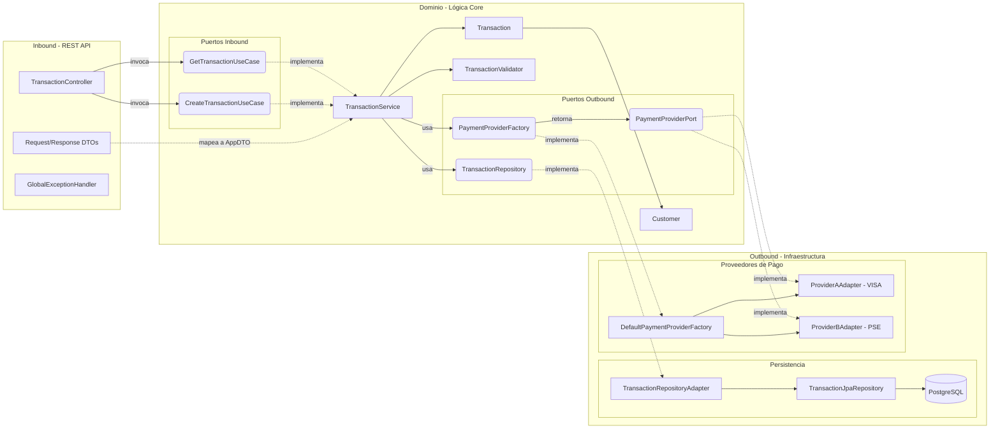

# Transaction Orchestrator API

API de orquestación de transacciones construida con **Java 21**, **Spring Boot 3** y estructurada bajo los principios de **Arquitectura Hexagonal (Ports & Adapters)** y **Domain-Driven Design (DDD)**.

## 🚀 Tecnologías Principales

*   **Lenguaje:** Java 21
*   **Framework:** Spring Boot 3.2.4
*   **Base de Datos:** PostgreSQL
*   **Migraciones:** Flyway
*   **Testing:** JUnit 5, jqwik (Property-Based Testing), Testcontainers
*   **CI/CD:** GitHub Actions (Validación de >80% de cobertura con JaCoCo)

---

## 🏗 Arquitectura Hexagonal

El proyecto está diseñado para separar estrictamente la lógica de negocio de las preocupaciones de infraestructura.

### Diagrama de Componentes



### Decisiones Arquitectónicas (ADRs)

1.  **Independencia del Dominio:**
    La capa de `domain` no tiene ninguna dependencia hacia Spring Boot, JPA, o Jackson. Esto permite que la lógica de negocio pueda ser probada unitariamente en milisegundos sin levantar un contexto de Spring y garantiza que el negocio dicte las reglas, no el framework.

2.  **Inversión de Dependencias (IoC) Manual:**
    Para mantener el dominio agnóstico, los servicios del dominio no usan anotaciones como `@Service` o `@Autowired`. La inyección se configura en la capa de infraestructura usando un `BeanConfig` (`@Configuration`), inyectando los adaptadores concretos hacia las interfaces (puertos) del dominio.

3.  **Manejo de Estados y CQRS (Command/Query Responsibility Segregation):**
    Separamos los objetos de transferencia de datos en `Commands` (para mutaciones, ej: `CreateTransactionCommand`) y consultas directas al modelo. El dominio delega la generación de identificadores (UUID v4) en vez de depender de secuencias de base de datos, lo que evita problemas de transaccionalidad temprana.

4.  **Property-Based Testing (jqwik):**
    Además del testing tradicional basado en ejemplos (Example-Based Testing), implementamos pruebas basadas en propiedades matemáticas. Esto somete la lógica de validación y transición de estados a cientos de casos límite aleatorios (edge cases) generados por la máquina, demostrando que la lógica es resiliente ante cualquier entrada válida o inválida.

5.  **Excepciones de Negocio Centralizadas:**
    Todas las validaciones arrojan excepciones propias del dominio (`DomainException`, `MissingFieldException`, etc.). Estas son capturadas en la capa de infraestructura por un `@RestControllerAdvice` (`GlobalExceptionHandler`), el cual se encarga de traducirlas a los códigos de respuesta (`response_code`) requeridos y a los estados HTTP correspondientes (Ej: 001 -> 400, 005 -> 200).

6.  **Patrón Factory para Proveedores de Pago:**
    La selección del proveedor de pago (Visa, PSE, etc.) se realiza mediante un `PaymentProviderFactory`. Esto sigue el principio Abierto/Cerrado (OCP) de SOLID: agregar un nuevo proveedor solo requiere crear un nuevo adaptador que implemente `PaymentProviderPort`, sin modificar el servicio central de transacciones.

## 🛠 Patrones de Diseño Aplicados

Durante el desarrollo de esta solución se implementaron los siguientes patrones de diseño y principios de ingeniería:

1. **Hexagonal Architecture (Ports & Adapters):** Permite aislar la lógica de negocio (Dominio) de los detalles técnicos (Bases de datos, APIs externas, Frameworks).
2. **Factory Method:** Se utilizó `PaymentProviderFactory` para instanciar y seleccionar dinámicamente el proveedor de pagos correcto en tiempo de ejecución basado en el `payment_method_id` recibido.
3. **Adapter Pattern:** Cada integración con un proveedor externo (Visa, PSE) se encapsula en una clase Adapter (ej. `ProviderAAdapter`), la cual traduce la interfaz genérica del dominio (`PaymentProviderPort`) al formato específico del proveedor.
4. **Dependency Injection (DI) & Inversion of Control (IoC):** Las dependencias son inyectadas a través de constructores, y la configuración de los beans se realiza manualmente (`BeanConfig`) para que el dominio no dependa de las anotaciones de Spring Boot.
5. **CQRS (Command/Query Responsibility Segregation):** Se separaron los modelos de escritura (`CreateTransactionCommand`) de los modelos de lectura, asegurando que las validaciones y transformaciones estén acotadas a su respectiva operación.
6. **Data Transfer Object (DTO):** Se usan DTOs (`CreateTransactionRequest`, `TransactionResponse`, `CustomerDto`) en la capa REST para no exponer las entidades de base de datos ni los agregados del dominio hacia el cliente.
7. **Exception Handling / Controller Advice:** Centralización del manejo de excepciones mediante un `@RestControllerAdvice`, permitiendo que el dominio lance excepciones semánticas (`InvalidFormatException`, `MissingFieldException`) que son traducidas automáticamente a códigos HTTP y `response_code` estandarizados.

---

## 🧐 Suposiciones y Decisiones del Negocio

Para el desarrollo del orquestador, se tomaron las siguientes suposiciones basadas en el análisis de los requerimientos:

* **Monto en Centavos:** Como lo dicta el requerimiento, el campo `amount` se recibe y procesa como un número entero largo (`Long` / `BIGINT`) sin separador decimal. Un valor de `150000` representa $1,500.00 en la moneda local.
* **Transaccionalidad Asíncrona (Estados):** Se asume que el pago a través de proveedores reales no siempre es instantáneo. Por ende, cuando el proveedor aprueba la transacción de entrada, el estado de la transacción en la base de datos queda en `PROCESSING`. Se espera que una futura integración mediante Webhook actualice el estado final a `SUCCESS` o `FAILED`.
* **Idempotencia:** Se asume que los clientes pueden reintentar la misma transacción en caso de fallos de red. Para prevenir cobros duplicados, se impuso una restricción `UNIQUE` en la base de datos sobre el campo `client_transaction_id`. Si se envía dos veces, el orquestador rechaza la segunda petición.
* **Fallas del Proveedor (HTTP 200 vs HTTP 500):** Si el proveedor rechaza la transacción (por ejemplo, por fondos insuficientes), la API retorna un **HTTP 200 OK**, ya que la petición y la comunicación se realizaron correctamente. El rechazo se comunica a través del `response_code: "005"` y el estado de la transacción se marca como `FAILED`.

---

## ⚠️ Riesgos Identificados

1. **Cuellos de Botella con Proveedores (Network Latency):** Las integraciones con proveedores de pago externos pueden sufrir alta latencia o timeouts. Si un proveedor tarda demasiado en responder, los hilos de Tomcat podrían saturarse. *Mitigación recomendada:* Implementar Circuit Breakers (ej. Resilience4j) y Timeouts estrictos en las llamadas HTTP salientes.
2. **Escalabilidad de la Base de Datos:** Si el volumen de transacciones crece de manera exponencial, la tabla `transactions` podría requerir particionamiento (Partitioning) por fechas, así como índices adicionales para acelerar las consultas históricas.
3. **Pérdida de Transacciones (Downtime del Proveedor):** Si el proveedor de pagos está caído, las transacciones serán rechazadas. *Mitigación recomendada:* Implementar un sistema de colas (ej. Kafka, RabbitMQ) para encolar las transacciones y reintentarlas mediante un proceso de *Retry Policy* (Dead Letter Queues).
4. **Inconsistencia de Estados:** Si el sistema falla o se reinicia justo después de enviar la petición al proveedor pero *antes* de actualizar el estado en nuestra base de datos. *Mitigación recomendada:* Implementar un *Saga Pattern* o guardar un registro de intención (Outbox Pattern) antes del envío.

---

## 🛡️ Modelo de Integración Continua (CI/CD) y Calidad de Código

El proyecto incluye un pipeline de Integración Continua (CI) implementado con **GitHub Actions** (`.github/workflows/ci.yml`), el cual se dispara automáticamente en cada `push` o `pull_request` hacia las ramas principales.

### Herramientas y Metodologías de Calidad:

1. **Testcontainers (Pruebas de Integración Reales):**
   No utilizamos bases de datos en memoria (como H2) para las pruebas de persistencia. En su lugar, el pipeline y las pruebas locales levantan un contenedor real de **PostgreSQL** mediante Docker. Esto garantiza que las pruebas de integración validen exactamente el mismo motor de base de datos que se utilizará en producción, incluyendo restricciones complejas como llaves foráneas y *constraints* de unicidad.

2. **Property-Based Testing (jqwik):**
   Además de las pruebas unitarias convencionales basadas en ejemplos (Example-Based Testing), se implementaron pruebas basadas en propiedades para la lógica de dominio y validación. `jqwik` genera automáticamente miles de casos límite (edge cases), cadenas aleatorias, valores nulos y números negativos para estresar la lógica y garantizar matemáticamente su robustez.

3. **JaCoCo (Métricas de Cobertura Estrictas):**
   El ciclo de compilación de Maven está configurado con el plugin de JaCoCo para auditar la cobertura de las pruebas. El pipeline está programado para **fallar automáticamente si la cobertura del código baja del 80%**. Esto previene que se integre código nuevo que no esté debidamente testeado. Las entidades, DTOs y clases de configuración fueron excluidas de esta métrica para enfocar la evaluación únicamente en la lógica de negocio y los controladores.

4. **Flyway (Migraciones Controladas):**
   La evolución del esquema de base de datos está automatizada y versionada a través de scripts SQL (`V1__init.sql`, `V2__...`). Esto previene inconsistencias entre los entornos de desarrollo, testing y producción.

---

## ⚙️ Ejecución y Pruebas

### Prerrequisitos
- Java 21
- Maven 3.8+
- Docker & Docker Compose (Para BD local y Testcontainers)

### Levantar el entorno local

1. Levantar la base de datos PostgreSQL:
   ```bash
   docker-compose up -d
   ```
2. Ejecutar la aplicación:
   ```bash
   mvn spring-boot:run
   ```

### Ejecutar Pruebas y Cobertura

El proyecto requiere un 80% de cobertura en la capa de negocio, validado por JaCoCo. Para ejecutar las pruebas unitarias y de integración (requiere Docker activo para Testcontainers):

```bash
mvn clean verify
```

El reporte de cobertura HTML se generará en `target/site/jacoco/index.html`.

---

## 🧪 Flujo de Pruebas Manuales (Postman / cURL)

Una vez que la aplicación esté corriendo localmente en el puerto `8080`, puedes probar el flujo de transacciones utilizando los siguientes comandos.

### 1. Creación Exitosa (Proveedor VISA)

Enviaremos una transacción válida. El proveedor simulado `CARD_VISA` aprobará la transacción y su estado quedará en `PROCESSING` (simulando que el pago está siendo procesado por la red de tarjetas de forma asíncrona).

**Request:**
```bash
curl --location 'http://localhost:8080/api/v1/transactions' \
--header 'Content-Type: application/json' \
--data '{
    "amount": 150000,
    "currency": "COP",
    "payment_method_id": "CARD_VISA",
    "client_transaction_id": "txn-abc-123",
    "customer": {
        "customer_id": "cust-001",
        "email": "juan@example.com",
        "full_name": "Juan Perez"
    },
    "billing_address": "Calle 123 # 45-67",
    "country": "CO"
}'
```

**Response Esperado (HTTP 200 OK):**
```json
{
    "response_code": "000",
    "message": "Successful operation",
    "data": {
        "transaction_id": "2d1e2b6c-3e3d-4c3e-8c3e-3e3d4c3e8c3e",
        "processed_at": "2026-04-10T15:30:00.123456Z",
        "client_transaction_id": "txn-abc-123",
        "payment_method_id": "CARD_VISA",
        "currency": "COP",
        "country": "CO",
        "description": "Pago de prueba"
    }
}
```

### 2. Consultar la Transacción Creada

Usa el `transaction_id` obtenido en el paso anterior para consultar su estado en la base de datos.

**Request:**
```bash
curl --location 'http://localhost:8080/api/v1/transactions/2d1e2b6c-3e3d-4c3e-8c3e-3e3d4c3e8c3e'
```

**Response Esperado (HTTP 200 OK):**
```json
{
    "response_code": "000",
    "message": "Successful operation",
    "data": {
        "transaction_id": "2d1e2b6c-3e3d-4c3e-8c3e-3e3d4c3e8c3e",
        "processed_at": "2026-04-10T15:30:00.123456Z",
        "client_transaction_id": "txn-abc-123",
        "payment_method_id": "CARD_VISA",
        "currency": "COP",
        "country": "CO",
        "description": "Pago de prueba"
    }
}
```

### 3. Rechazo por Proveedor (Fondos Insuficientes)

Simularemos un rechazo. Nuestro proveedor `CARD_VISA` está programado para rechazar cualquier transacción que tenga un monto exactamente igual a **9999.99**.

**Request:**
```bash
curl --location 'http://localhost:8080/api/v1/transactions' \
--header 'Content-Type: application/json' \
--data '{
    "amount": 9999,
    "currency": "COP",
    "payment_method_id": "CARD_VISA",
    "client_transaction_id": "txn-reject-001",
    "customer": {
        "customer_id": "cust-002",
        "email": "ana@example.com",
        "full_name": "Ana Gomez"
    },
    "billing_address": "Carrera 45 # 12-34",
    "country": "CO"
}'
```

**Response Esperado (HTTP 200 OK):**
*(Nota: Devuelve 200 OK porque la petición HTTP fue exitosa, pero el código de negocio "005" indica que el proveedor la declinó)*
```json
{
    "response_code": "005",
    "message": "Transacción rechazada por el proveedor",
    "data": {
        "transaction_id": "8f2a3c7d-4b5e-5d4f-9d4f-4b5e5d4f9d4f",
        "processed_at": "2026-04-10T15:35:00.123456Z",
        "client_transaction_id": "txn-reject-001",
        "payment_method_id": "CARD_VISA",
        "currency": "COP",
        "country": "CO",
        "description": "Pago fallido"
    }
}
```

### 4. Error de Validación de Dominio (Monto Negativo)

Si intentas enviar datos inválidos (como un monto negativo o correos mal formados), el sistema lo bloqueará en la capa de negocio antes de llegar a la base de datos.

**Request:**
```bash
curl --location 'http://localhost:8080/api/v1/transactions' \
--header 'Content-Type: application/json' \
--data '{
    "amount": -50.00,
    "currency": "COP",
    "payment_method_id": "CARD_VISA",
    "client_transaction_id": "txn-invalid-001",
    "customer": {
        "customer_id": "cust-003",
        "email": "correo-invalido",
        "full_name": "Carlos Lopez"
    },
    "billing_address": "Avenida 1",
    "country": "CO"
}'
```

**Response Esperado (HTTP 400 Bad Request):**
```json
{
    "response_code": "002",
    "message": "El monto debe ser mayor a cero"
}
```
