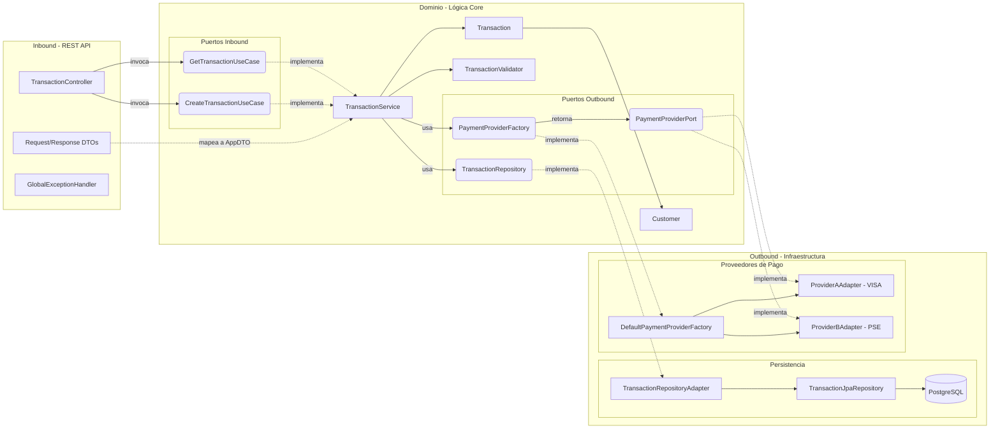

# Transaction Orchestrator API

API de orquestación de transacciones construida con **Java 21**, **Spring Boot 3** y estructurada bajo los principios de **Arquitectura Hexagonal (Ports & Adapters)** y **Domain-Driven Design (DDD)**.

## 🚀 Tecnologías Principales

*   **Lenguaje:** Java 21
*   **Framework:** Spring Boot 3.2.4
*   **Base de Datos:** PostgreSQL
*   **Migraciones:** Flyway
*   **Testing:** JUnit 5, jqwik (Property-Based Testing), Testcontainers
*   **CI/CD:** GitHub Actions (Validación de >80% de cobertura con JaCoCo)

---

## 🏗 Arquitectura Hexagonal

El proyecto está diseñado para separar estrictamente la lógica de negocio de las preocupaciones de infraestructura.

### Diagrama de Componentes



### Decisiones Arquitectónicas (ADRs)

1.  **Independencia del Dominio:**
    La capa de `domain` no tiene ninguna dependencia hacia Spring Boot, JPA, o Jackson. Esto permite que la lógica de negocio pueda ser probada unitariamente en milisegundos sin levantar un contexto de Spring y garantiza que el negocio dicte las reglas, no el framework.

2.  **Inversión de Dependencias (IoC) Manual:**
    Para mantener el dominio agnóstico, los servicios del dominio no usan anotaciones como `@Service` o `@Autowired`. La inyección se configura en la capa de infraestructura usando un `BeanConfig` (`@Configuration`), inyectando los adaptadores concretos hacia las interfaces (puertos) del dominio.

3.  **Manejo de Estados y CQRS (Command/Query Responsibility Segregation):**
    Separamos los objetos de transferencia de datos en `Commands` (para mutaciones, ej: `CreateTransactionCommand`) y consultas directas al modelo. El dominio delega la generación de identificadores (UUID v4) en vez de depender de secuencias de base de datos, lo que evita problemas de transaccionalidad temprana.

4.  **Property-Based Testing (jqwik):**
    Además del testing tradicional basado en ejemplos (Example-Based Testing), implementamos pruebas basadas en propiedades matemáticas. Esto somete la lógica de validación y transición de estados a cientos de casos límite aleatorios (edge cases) generados por la máquina, demostrando que la lógica es resiliente ante cualquier entrada válida o inválida.

5.  **Excepciones de Negocio Centralizadas:**
    Todas las validaciones arrojan excepciones propias del dominio (`DomainException`, `MissingFieldException`, etc.). Estas son capturadas en la capa de infraestructura por un `@RestControllerAdvice` (`GlobalExceptionHandler`), el cual se encarga de traducirlas a los códigos de respuesta (`response_code`) requeridos y a los estados HTTP correspondientes (Ej: 001 -> 400, 005 -> 200).

6.  **Patrón Factory para Proveedores de Pago:**
    La selección del proveedor de pago (Visa, PSE, etc.) se realiza mediante un `PaymentProviderFactory`. Esto sigue el principio Abierto/Cerrado (OCP) de SOLID: agregar un nuevo proveedor solo requiere crear un nuevo adaptador que implemente `PaymentProviderPort`, sin modificar el servicio central de transacciones.

---

## ⚙️ Ejecución y Pruebas

### Prerrequisitos
- Java 21
- Maven 3.8+
- Docker & Docker Compose (Para BD local y Testcontainers)

### Levantar el entorno local

1. Levantar la base de datos PostgreSQL:
   ```bash
   docker-compose up -d
   ```
2. Ejecutar la aplicación:
   ```bash
   mvn spring-boot:run
   ```

### Ejecutar Pruebas y Cobertura

El proyecto requiere un 80% de cobertura en la capa de negocio, validado por JaCoCo. Para ejecutar las pruebas unitarias y de integración (requiere Docker activo para Testcontainers):

```bash
mvn clean verify
```

El reporte de cobertura HTML se generará en `target/site/jacoco/index.html`.

---

## 🧪 Flujo de Pruebas Manuales (Postman / cURL)

Una vez que la aplicación esté corriendo localmente en el puerto `8080`, puedes probar el flujo de transacciones utilizando los siguientes comandos.

### 1. Creación Exitosa (Proveedor VISA)

Enviaremos una transacción válida. El proveedor simulado `CARD_VISA` aprobará la transacción y su estado quedará en `PROCESSING` (simulando que el pago está siendo procesado por la red de tarjetas de forma asíncrona).

**Request:**
```bash
curl --location 'http://localhost:8080/api/v1/transactions' \
--header 'Content-Type: application/json' \
--data '{
    "amount": 150000,
    "currency": "COP",
    "payment_method_id": "CARD_VISA",
    "client_transaction_id": "txn-abc-123",
    "customer": {
        "customer_id": "cust-001",
        "email": "juan@example.com",
        "full_name": "Juan Perez"
    },
    "billing_address": "Calle 123 # 45-67",
    "country": "CO"
}'
```

**Response Esperado (HTTP 200 OK):**
```json
{
    "response_code": "000",
    "message": "Successful operation",
    "data": {
        "transaction_id": "2d1e2b6c-3e3d-4c3e-8c3e-3e3d4c3e8c3e",
        "processed_at": "2026-04-10T15:30:00.123456Z",
        "client_transaction_id": "txn-abc-123",
        "payment_method_id": "CARD_VISA",
        "currency": "COP",
        "country": "CO",
        "description": "Pago de prueba"
    }
}
```

### 2. Consultar la Transacción Creada

Usa el `transaction_id` obtenido en el paso anterior para consultar su estado en la base de datos.

**Request:**
```bash
curl --location 'http://localhost:8080/api/v1/transactions/2d1e2b6c-3e3d-4c3e-8c3e-3e3d4c3e8c3e'
```

**Response Esperado (HTTP 200 OK):**
```json
{
    "response_code": "000",
    "message": "Successful operation",
    "data": {
        "transaction_id": "2d1e2b6c-3e3d-4c3e-8c3e-3e3d4c3e8c3e",
        "processed_at": "2026-04-10T15:30:00.123456Z",
        "client_transaction_id": "txn-abc-123",
        "payment_method_id": "CARD_VISA",
        "currency": "COP",
        "country": "CO",
        "description": "Pago de prueba"
    }
}
```

### 3. Rechazo por Proveedor (Fondos Insuficientes)

Simularemos un rechazo. Nuestro proveedor `CARD_VISA` está programado para rechazar cualquier transacción que tenga un monto exactamente igual a **9999.99**.

**Request:**
```bash
curl --location 'http://localhost:8080/api/v1/transactions' \
--header 'Content-Type: application/json' \
--data '{
    "amount": 9999,
    "currency": "COP",
    "payment_method_id": "CARD_VISA",
    "client_transaction_id": "txn-reject-001",
    "customer": {
        "customer_id": "cust-002",
        "email": "ana@example.com",
        "full_name": "Ana Gomez"
    },
    "billing_address": "Carrera 45 # 12-34",
    "country": "CO"
}'
```

**Response Esperado (HTTP 200 OK):**
*(Nota: Devuelve 200 OK porque la petición HTTP fue exitosa, pero el código de negocio "005" indica que el proveedor la declinó)*
```json
{
    "response_code": "005",
    "message": "Transacción rechazada por el proveedor",
    "data": {
        "transaction_id": "8f2a3c7d-4b5e-5d4f-9d4f-4b5e5d4f9d4f",
        "processed_at": "2026-04-10T15:35:00.123456Z",
        "client_transaction_id": "txn-reject-001",
        "payment_method_id": "CARD_VISA",
        "currency": "COP",
        "country": "CO",
        "description": "Pago fallido"
    }
}
```

### 4. Error de Validación de Dominio (Monto Negativo)

Si intentas enviar datos inválidos (como un monto negativo o correos mal formados), el sistema lo bloqueará en la capa de negocio antes de llegar a la base de datos.

**Request:**
```bash
curl --location 'http://localhost:8080/api/v1/transactions' \
--header 'Content-Type: application/json' \
--data '{
    "amount": -50.00,
    "currency": "COP",
    "payment_method_id": "CARD_VISA",
    "client_transaction_id": "txn-invalid-001",
    "customer": {
        "customer_id": "cust-003",
        "email": "correo-invalido",
        "full_name": "Carlos Lopez"
    },
    "billing_address": "Avenida 1",
    "country": "CO"
}'
```

**Response Esperado (HTTP 400 Bad Request):**
```json
{
    "response_code": "002",
    "message": "El monto debe ser mayor a cero"
}
```
